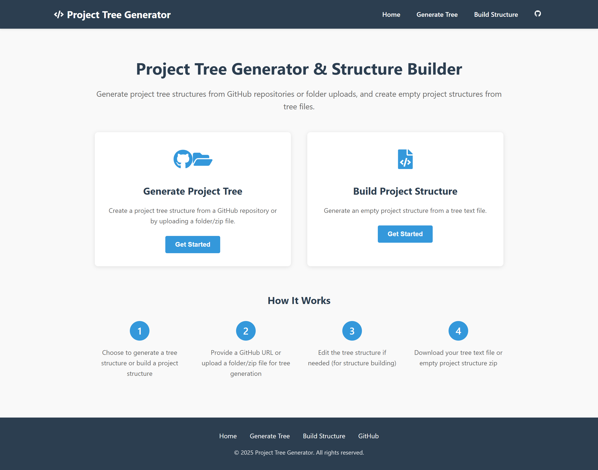

# 🌲 Project Tree Generator

A web application that generates project tree structures from GitHub repositories or uploaded files, and creates empty project scaffolds from tree text files.

[](https://project-tree-generator.rohitrana.dev/)

## 🌟 Live Demo

Check out the live demo: [Project Tree Generator](https://project-tree-generator.rohitrana.dev/)

## 📝 My Portfolio

Check out my portfolio: [Rohit Rana Portfolio](https://rohitrana.dev/)

## ✨ Features

### 📝 Generate Project Tree Structure

- **From GitHub Repository**
  - Input any public GitHub repository URL
  - Select specific branches
  - Specify subfolder paths for partial tree generation
- **From File Upload**
  - Upload ZIP files containing project folders
  - Automatically process and generate tree structure

### 🔄 Build Empty Project Structure

- Input or paste tree structure text
- Use tree editor with syntax highlighting
- Generate downloadable ZIP file with empty structure
- Create project scaffolds quickly

## 🛠️ Technologies

### Frontend

- React
- React Router for navigation
- Monaco Editor for tree editing
- File-saver for handling downloads
- React-icons for UI elements

### Backend

- Node.js
- Express.js
- Octokit/REST for GitHub API integration
- Multer for file uploads
- AdmZip for handling zip files
- Archiver for creating zip files

## 🚀 Getting Started

### Prerequisites

- Node.js (v14 or later)
- npm (v6 or later)

### Installation

1. **Clone the repository**

   ```bash
   git clone https://github.com/rohitrana043/project-tree-generator.git
   cd project-tree-generator
   ```

2. **Install dependencies**

   ```bash
   # Install root dependencies and both client and server dependencies
   npm run install-all
   ```

3. **Configuration**

   - Create a `.env` file in the server directory:

   ```
   # .env file in server/
   PORT=5000
   NODE_ENV=development
   GITHUB_TOKEN=your_github_token  # Optional: for higher rate limits
   ```

4. **Start the development server**

   ```bash
   # Run both frontend and backend in development mode
   npm run dev
   ```

5. **Access the application**
   - Frontend: http://localhost:3000
   - Backend API: http://localhost:5000

## 📋 Usage Examples

### Generating a Project Tree from GitHub

1. Navigate to the "Generate Project Tree" page
2. Enter a GitHub repository URL (e.g., https://github.com/facebook/react)
3. Select a branch (e.g., main)
4. Optionally enter a subfolder path (e.g., packages/react-dom)
5. Click "Generate Tree"
6. The tree structure will be displayed for copying or downloading

### Generating an Empty Project Structure

1. Navigate to the "Build Project Structure" page
2. Enter a project name
3. Paste or type a tree structure in the editor
   ```
   project-name/
   ├─ src/
   │  ├─ components/
   │  │  └─ App.js
   │  ├─ styles/
   │  │  └─ main.css
   │  └─ index.js
   ├─ public/
   │  └─ index.html
   └─ package.json
   ```
4. Click "Generate & Download"
5. A ZIP file containing the empty project structure will be downloaded

## 📚 API Endpoints

### GitHub Integration

- `GET /api/github/branches?owner=:owner&repo=:repo` - Get repository branches
- `POST /api/github/tree` - Generate tree from GitHub repository

### File Upload

- `POST /api/upload/tree` - Generate tree from uploaded file

### Structure Builder

- `POST /api/builder/generate` - Generate empty structure from tree

## 🏗️ Project Structure

```
project-tree-generator/
├─ client/                      # Frontend React application
├─ server/                      # Backend Express application
│  ├─ controllers/              # Request handlers
│  ├─ routes/                   # API routes
│  ├─ services/                 # Business logic
│  ├─ tmp/                      # Temporary files
│  └─ server.js                 # Entry point
└─ package.json                 # Root package.json
```

## 🤝 Contributing

Contributions are welcome! Please feel free to submit a Pull Request.

1. Fork the repository
2. Create your feature branch (`git checkout -b feature/amazing-feature`)
3. Commit your changes (`git commit -m 'Add some amazing feature'`)
4. Push to the branch (`git push origin feature/amazing-feature`)
5. Open a Pull Request

## 📄 License

This project is licensed under the MIT License - see the [LICENSE](LICENSE) file for details.

## ✉️ Contact

Rohit Rana - [rohitrana043@gmail.com](mailto:rohitrana043@gmail.com)

Project Link: [https://github.com/rohitrana043/project-tree-generator](https://github.com/rohitrana043/project-tree-generator)

Live Demo: [https://project-tree-generator.rohitrana.dev/](https://project-tree-generator.rohitrana.dev/)
